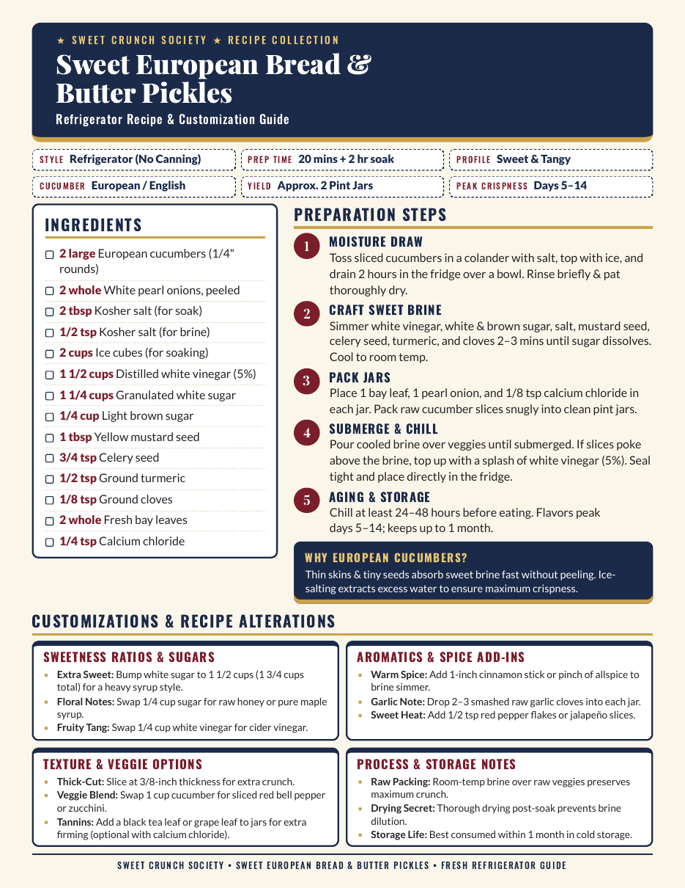

# Sweet Crunch Society

A printable, single-page recipe card for **Sweet European Bread & Butter Pickles**, a refrigerator (no-canning) clone of the store-bought classic.

## Warnings

**Make this at your own risk.** This is a home recipe shared as-is, with no warranty. You are responsible for food safety. **Pickles made from this recipe may not be sold.**

Refrigerator pickles are not canned or heat-processed, so they are **not shelf-stable**. Follow these rules:

- **Keep them cold.** Store the jars in the refrigerator at 40°F (4°C) or below at all times. Do not leave them at room temperature except while serving.
- **Start clean.** Wash your hands, use clean utensils, and sterilize the jars before filling them.
- **Use 5% vinegar.** Use distilled white vinegar labeled 5% acidity, and do not reduce the vinegar or swap in a vinegar of unknown strength. The acid level is what makes the pickles safe.
- **Do not can this recipe.** It has not been tested for water-bath canning. Keep it as a refrigerator pickle only.
- **Keep the vegetables under the brine.** Submerged food stays safer and firmer.
- **Toss questionable jars.** Discard the jar if you see mold, slime, fizzing or unusual bubbling, a bulging lid, or an off smell. When in doubt, throw it out.

Sources: [UMN Extension: Pickling basics](https://extension.umn.edu/preserving-and-preparing/pickling-basics) and the [National Center for Home Food Preservation](https://nchfp.uga.edu/how/pickle/general-information-pickling/general-information-on-pickling/).

## Why

Store-bought bread & butter pickles are sweet, tangy, and very crunchy. This recipe recreates that at home with European cucumbers, a salt-and-ice soak, and calcium chloride for extra snap. The card is one self-contained HTML file that prints cleanly on US Letter paper, so it can live on the fridge or in a recipe binder.

## The recipe at a glance

| Detail | Value |
|---|---|
| **Style** | Refrigerator, no canning |
| **Prep time** | 20 mins + 2 hr soak |
| **Yield** | About 2 pint jars |
| **Peak crispness** | Days 5-14 |

## Accessibility

- Semantic HTML: one `h1`, `h2` sections, and `h3` cards, with `<header>`, `<main>`, and `<footer>` landmarks
- Steps are an ordered list and ingredients are a list
- Decorative SVGs are hidden from screen readers with `aria-hidden`; the society name is also plain text in the header and footer
- Text colors were chosen for readable contrast on their backgrounds

## Editing the recipe

All recipe text is plain HTML in `index.html`. Ingredients are `<li>` items in the Ingredients section, steps are `<li>` items in the Preparation Steps `<ol>`, and the four customization cards are at the bottom. The page is fixed to one Letter sheet, so if you add a lot of text, check the print preview for overflow.
